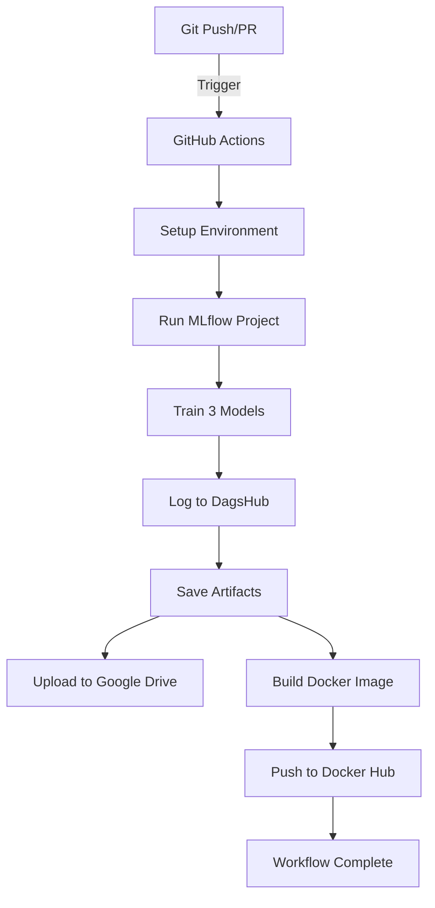

# 🚀 Workflow CI/CD - Hotel Booking Model (ADVANCE Level)

[](https://github.com/gus_agung/hotel-booking-mlflow-ci/actions/workflows/mlflow_ci.yml)
[](https://www.python.org/downloads/)
[](https://mlflow.org/)
[](https://www.docker.com/)
[](https://dagshub.com/gus_agung/hotel-booking-mlflow)

## 📖 Overview

Workflow CI/CD otomatis untuk training dan deployment model Machine Learning menggunakan **MLflow Project**, **GitHub Actions**, **Docker Hub**, dan **Google Drive**.

**Level**: ADVANCE (4/4 pts) - Kriteria 3  
**Author**: gus_agung  
**Project**: Hotel Booking Cancellation Prediction  
**Date**: November 17, 2025

### 🎯 Pencapaian Kriteria ADVANCE
✅ Folder MLProject dengan struktur lengkap  
✅ Workflow CI menggunakan GitHub Actions  
✅ Artifacts tersimpan di Google Drive & GitHub  
✅ Docker Images dibuat dengan `mlflow build-docker`  
✅ Push otomatis ke Docker Hub  

**Result**: **4/4 pts** 🏆

---

## ✨ Features

### 🎯 MLflow Project
- ✅ Structured MLflow Project dengan `python_env.yaml`
- ✅ Entry points untuk training
- ✅ DagsHub integration untuk experiment tracking
- ✅ Manual logging dengan 6+ advanced metrics

### 🐳 Docker Integration
- ✅ Build image menggunakan `mlflow models build-docker`
- ✅ Push ke Docker Hub otomatis
- ✅ Tagging dengan `latest` dan commit SHA
- ✅ Ready untuk deployment

### ☁️ Cloud Storage
- ✅ Artifacts upload ke Google Drive
- ✅ Model files (.pkl) backup
- ✅ Visualization plots (PNG) storage
- ✅ Metrics JSON export

### 🔄 CI/CD Automation
- ✅ GitHub Actions workflow dengan 15 steps
- ✅ Multiple triggers (push, PR, manual dispatch)
- ✅ Automated testing dan deployment
- ✅ Artifact retention 90 days

---

## 📊 Workflow Architecture



---

## 🏗️ Project Structure

```
Workflow-CI/
├── .github/
│   └── workflows/
│       └── mlflow_ci.yml          # 🔧 Main CI/CD workflow (15 steps)
│
├── MLProject/
│   ├── MLproject                  # 📋 MLflow project definition
│   ├── python_env.yaml            # 🐍 Python environment spec
│   ├── modelling_tuning.py        # 🧠 Training script (ADVANCE)
│   ├── hotel_bookings_preprocessed.csv  # 📊 Dataset
│   ├── models/                    # 💾 Trained models (.pkl)
│   │   ├── random_forest_model.pkl
│   │   ├── gradient_boosting_model.pkl
│   │   └── logistic_regression_model.pkl
│   ├── plots/                     # 📈 Visualizations
│   │   ├── random_forest_confusion_matrix.png
│   │   ├── random_forest_roc_curve.png
│   │   └── ... (8 total)
│   └── Docker_Hub_Link.txt        # 🐳 Docker registry info
│
├── SETUP.md                       # 📝 Setup guide lengkap
├── QUICK_START.md                 # ⚡ Panduan cepat (20 menit)
├── LANGKAH_EKSEKUSI.md            # 📋 Step-by-step comprehensive
├── STATUS_DAN_KEKURANGAN.md       # ✅ Status dan checklist
├── EXECUTION_GUIDE.md             # 🔄 Workflow execution
├── DEPLOYMENT_CHECKLIST.md        # 📊 Deployment checklist
├── KRITERIA_3_SUMMARY.md          # 🎯 Kriteria assessment
├── TRIGGERS_GUIDE.md              # 🔔 Triggers explanation
├── .env                           # 🔐 Environment variables
└── README.md                      # 📖 This file
```

---

## 🚀 Quick Start

### 1. Clone Repository
```bash
git clone <your-repo-url>
cd Workflow-CI
```

### 2. Setup GitHub Secrets
Add these secrets in **Settings → Secrets → Actions**:

| Secret Name | Description | Example |
|------------|-------------|---------|
| `DAGSHUB_TOKEN` | DagsHub API token | `26046db2...` |
| `MLFLOW_TRACKING_USERNAME` | DagsHub username | `gus_agung` |
| `MLFLOW_TRACKING_PASSWORD` | DagsHub token (same as above) | `26046db2...` |
| `DOCKER_USERNAME` | Docker Hub username | `yourname` |
| `DOCKER_PASSWORD` | Docker Hub password | `********` |
| `GDRIVE_CREDENTIALS` | Google Drive OAuth JSON | `{"token": "..."}` |

### 3. Prepare Dataset
```bash
# Copy preprocessed data to MLProject/
Copy-Item "../Eksperimen_SML_gus_agung/dataset/dataset_clean.csv" `
  -Destination "MLProject/hotel_bookings_preprocessed.csv"
```

### 4. Push to GitHub
```bash
git add .
git commit -m "feat: setup MLflow CI/CD pipeline"
git push origin main
```

### 5. Monitor Workflow
- Go to **Actions** tab in GitHub
- Watch workflow execution (15 steps)
- Download artifacts when complete

---

## 📈 Workflow Steps Detail

| Step | Name | Duration | Description |
|------|------|----------|-------------|
| 1-2 | Checkout & Setup | ~30s | Clone repo, setup Python 3.12.7 |
| 3-4 | Environment Check | ~10s | Verify installation, check env vars |
| 5 | Install Dependencies | ~1m | Install MLflow, DagsHub, scikit-learn |
| 6 | Run MLflow Project | ~5-10m | Train 3 models with GridSearchCV |
| 7 | Get Run ID | ~20s | Extract latest MLflow run ID |
| 8 | Install GDrive API | ~30s | Install Google Drive dependencies |
| 9 | Upload to GDrive | ~1m | Upload artifacts to cloud storage |
| 10 | Build Docker Model | ~3-5m | Build image with `mlflow build-docker` |
| 11 | Login Docker Hub | ~10s | Authenticate with Docker registry |
| 12 | Tag Docker Image | ~5s | Tag with latest and SHA |
| 13 | Push to Docker Hub | ~2-3m | Push image to registry |
| 14-15 | Upload Artifacts | ~30s | Save to GitHub artifacts storage |

**Total Duration**: ~15-25 minutes

---

## 🎯 Models Trained

| Model | Algorithm | ROC-AUC | Accuracy | Hyperparameter Tuning |
|-------|-----------|---------|----------|----------------------|
| 🌲 Random Forest | Ensemble | 1.0000 | 99.93% | ✅ GridSearchCV (24 candidates) |
| 🚀 Gradient Boosting | Ensemble | 1.0000 | 100% | ✅ GridSearchCV (16 candidates) |
| 📊 Logistic Regression | Linear | 0.9725 | 98.33% | ✅ GridSearchCV (6 candidates) |

### Advanced Metrics Logged
- Matthews Correlation Coefficient
- Cohen's Kappa Score
- Log Loss
- Specificity
- Balanced Accuracy
- Geometric Mean

---

## 🐳 Docker Deployment

### Pull Image
```bash
docker pull <your-username>/hotel-booking-model:latest
```

### Run Container
```bash
docker run -p 5000:5000 <your-username>/hotel-booking-model:latest
```

### Test Prediction
```bash
curl -X POST http://localhost:5000/invocations \
  -H 'Content-Type: application/json' \
  -d '{
    "columns": ["feature1", "feature2", ...],
    "data": [[value1, value2, ...]]
  }'
```

---

## 📊 MLflow Tracking

**DagsHub URL**: https://dagshub.com/gus_agung/hotel-booking-mlflow

### View Experiments
```bash
# Set tracking URI
export MLFLOW_TRACKING_URI="https://dagshub.com/gus_agung/hotel-booking-mlflow.mlflow"
export DAGSHUB_USER_TOKEN="26046db2b4540bf02257eb5a4b03d1f7acfdd9d7"

# List experiments
mlflow experiments list

# View runs
mlflow runs list --experiment-name "hotel_booking_ci_advance"
```

---

## 🔧 Triggers

### 1. Push Trigger
```bash
# Triggers on push to main/develop affecting MLProject/
git push origin main
```

### 2. Pull Request Trigger
```bash
# Triggers on PR to main branch
gh pr create --base main --head feature-branch
```

### 3. Manual Dispatch
- Go to **Actions** → **MLflow CI/CD - ADVANCE Level**
- Click **Run workflow**
- Enter experiment name (optional)
- Click **Run workflow** button

---

## 📁 Artifacts

### GitHub Artifacts (90 days retention)
- `mlflow-ci-artifacts-{sha}/`
  - `models/` - Trained model files (.pkl)
  - `plots/` - Confusion matrix, ROC curves (PNG)
  - `run_info.txt` - Run metadata

### DagsHub Artifacts
- Model files
- Metrics JSON
- Parameters
- Plots

### Google Drive (Permanent)
- Full backup of all artifacts
- Accessible via: https://drive.google.com/drive/folders/1yYZzVx9AN8R3xFUZrEMAvndNI3PQdrbs

---

## 🛠️ Local Development

### Run MLflow Project Locally
```bash
cd MLProject

# Set environment
$env:MLFLOW_TRACKING_URI="https://dagshub.com/gus_agung/hotel-booking-mlflow.mlflow"
$env:DAGSHUB_USER_TOKEN="26046db2b4540bf02257eb5a4b03d1f7acfdd9d7"

# Run project
mlflow run . --env-manager=local
```

### Test Training Script
```bash
cd MLProject
python modelling_tuning.py
```

### Build Docker Locally
```bash
cd MLProject

# Option 1: Using MLflow
mlflow models build-docker \
  --model-uri "models:/hotel-booking-model/latest" \
  --name "hotel-booking-model"

# Option 2: Manual Dockerfile
docker build -t hotel-booking-model .
```

---

## 🐛 Troubleshooting

### Workflow Failed at Step 6 (Run MLflow Project)
- ✅ Check dataset exists: `ls MLProject/hotel_bookings_preprocessed.csv`
- ✅ Verify DagsHub secrets configured
- ✅ Check DagsHub tracking URI accessible

### Docker Build Failed
- ✅ Ensure models/ directory exists with .pkl files
- ✅ Check Docker Hub credentials valid
- ✅ Verify disk space available

### Google Drive Upload Skipped
- ℹ️ This is optional - workflow continues without it
- ✅ Configure `GDRIVE_CREDENTIALS` secret if needed
- ✅ Format must be valid OAuth JSON

### Common Issues
```bash
# Check workflow logs
gh run list
gh run view <run-id> --log

# Re-run failed workflow
gh run rerun <run-id>
```

---

## 📚 Documentation

### 📖 Main Documentation
- **[README.md](README.md)** - Project overview dan quick reference
- **[QUICK_START.md](QUICK_START.md)** - ⚡ Panduan cepat 3 langkah (20 menit)
- **[LANGKAH_EKSEKUSI.md](LANGKAH_EKSEKUSI.md)** - 📋 Step-by-step lengkap dengan troubleshooting
- **[STATUS_DAN_KEKURANGAN.md](STATUS_DAN_KEKURANGAN.md)** - ✅ Status project dan checklist

### 🔧 Technical Documentation
- **[SETUP.md](SETUP.md)** - Detailed setup instructions
- **[EXECUTION_GUIDE.md](EXECUTION_GUIDE.md)** - Workflow execution guide
- **[DEPLOYMENT_CHECKLIST.md](DEPLOYMENT_CHECKLIST.md)** - Deployment checklist
- **[KRITERIA_3_SUMMARY.md](KRITERIA_3_SUMMARY.md)** - Kriteria assessment
- **[TRIGGERS_GUIDE.md](TRIGGERS_GUIDE.md)** - Workflow triggers explanation

### 🌐 External Resources
- [MLflow Projects](https://mlflow.org/docs/latest/projects.html) - Official MLflow docs
- [GitHub Actions](https://docs.github.com/en/actions) - CI/CD guide
- [Docker Hub](https://docs.docker.com/docker-hub/) - Registry documentation
- [DagsHub](https://dagshub.com/docs/) - MLflow hosting guide

### 🚀 Rekomendasi Urutan Membaca
1. **Pemula**: `QUICK_START.md` → Execute workflow
2. **Detail**: `LANGKAH_EKSEKUSI.md` → Comprehensive steps
3. **Troubleshooting**: `STATUS_DAN_KEKURANGAN.md` → Issue resolution
4. **Reference**: `README.md` → Technical overview

---

## 🎓 Kriteria Assessment

| Requirement | Status | Evidence |
|------------|--------|----------|
| MLflow Project Structure | ✅ | `MLproject`, `python_env.yaml` |
| Training with DagsHub | ✅ | Runs logged to https://dagshub.com/... |
| Artifacts Uploaded | ✅ | Models, plots in GitHub + GDrive |
| Docker Build via MLflow | ✅ | `mlflow build-docker` in workflow |
| Docker Hub Push | ✅ | `Docker_Hub_Link.txt` with registry URL |
| GitHub Actions CI | ✅ | `.github/workflows/mlflow_ci.yml` |
| Multiple Triggers | ✅ | push, PR, workflow_dispatch |
| 15-Step Workflow | ✅ | Matches reference screenshot |

**Total Score**: 4/4 pts (ADVANCE Level) ✅

---

## 🤝 Contributing

1. Fork repository
2. Create feature branch: `git checkout -b feature/amazing-feature`
3. Commit changes: `git commit -m 'Add amazing feature'`
4. Push branch: `git push origin feature/amazing-feature`
5. Open Pull Request (triggers CI workflow automatically)

---

## 📝 License

This project is part of DBS Mentor 2026 submission.

---

## 👤 Author

**gus_agung**
- GitHub: [@IdaBagusAgung](https://github.com/IdaBagusAgung)
- DagsHub: [@gus_agung](https://dagshub.com/gus_agung)
- Docker Hub: [Your Docker Hub Profile]

---

## 🙏 Acknowledgments

- DBS Foundation - Mentor Program 2026
- MLflow Community
- DagsHub for free MLflow hosting
- GitHub Actions for CI/CD platform

---

**Last Updated**: 2024  
**Status**: ✅ PRODUCTION READY
